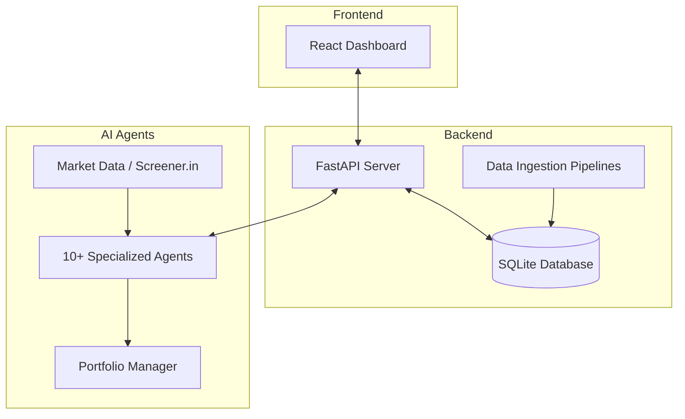

# AI Hedge Fund (Indian Market Edition)

This is a proof of concept for an AI-powered hedge fund tailored for the **Indian Stock Market (NSE)**. The goal of this project is to explore the use of AI to make trading decisions, utilizing fundamental data from Screener.in and technical analysis. This project is for **educational** purposes only and is not intended for real trading or investment.

This system employs several agents working together, combined with a robust backend and an interactive frontend dashboard:

1. Aswath Damodaran Agent - The Dean of Valuation, focuses on story, numbers, and disciplined valuation
2. Ben Graham Agent - The godfather of value investing, only buys hidden gems with a margin of safety
3. Bill Ackman Agent - An activist investor, takes bold positions and pushes for change
4. Cathie Wood Agent - The queen of growth investing, believes in the power of innovation and disruption
5. Charlie Munger Agent - Warren Buffett's partner, only buys wonderful businesses at fair prices
6. Michael Burry Agent - The Big Short contrarian who hunts for deep value
7. Mohnish Pabrai Agent - The Dhandho investor, who looks for doubles at low risk
8. Nassim Taleb Agent - The Black Swan risk analyst, focuses on tail risk, antifragility, and asymmetric payoffs
9. Peter Lynch Agent - Practical investor who seeks "ten-baggers" in everyday businesses
10. Phil Fisher Agent - Meticulous growth investor who uses deep "scuttlebutt" research 
11. Rakesh Jhunjhunwala Agent - The Big Bull of India, focused on high growth opportunities in Indian markets
12. Stanley Druckenmiller Agent - Macro legend who hunts for asymmetric opportunities with growth potential
13. Warren Buffett Agent - The oracle of Omaha, seeks wonderful companies at a fair price
14. Valuation Agent - Calculates the intrinsic value of a stock and generates trading signals
15. Sentiment Agent - Analyzes market sentiment and generates trading signals
16. Fundamentals Agent - Analyzes fundamental data (via Screener.in) and generates trading signals
17. Technicals Agent - Analyzes technical indicators and generates trading signals
18. Risk Manager - Calculates risk metrics and sets position limits
19. Portfolio Manager - Makes final trading decisions and generates orders

### System Architecture



### Agent Workflow

```mermaid
graph TD
    subgraph Data Sources
        Price[Price Data NSE]
        Fund[Fundamental Data Screener.in]
    end

    subgraph Analysts
        Val[Valuation Agent]
        Sent[Sentiment Agent]
        Tech[Technicals Agent]
        FundA[Fundamentals Agent]
    end

    subgraph Master Investors
        Buffett[Warren Buffett Agent]
        Damodaran[Aswath Damodaran Agent]
        Wood[Cathie Wood Agent]
        Others[...other investor agents]
    end

    Price --> Tech
    Price --> Val
    Fund --> FundA
    Fund --> Val
    
    Analysts --> Risk[Risk Manager]
    Master Investors --> Risk
    Risk --> PM[Portfolio Manager]
```

**Features:**
* **Indian Market Focus:** Designed to analyze NSE tickers (e.g., RELIANCE.NS, TCS.NS).
* **Data Persistence:** Uses an SQLite database (`hedge_fund.db`) to store price and fundamental data.
* **Interactive UI:** A React frontend (`app/`) to view analysis, trigger data ingestion, and manage stock wishlists.
* **Wishlists:** Ability to manage custom lists of stocks for targeted analysis (including a pre-populated Nifty 500 list).
* **Pipelines:** Scripts for ingesting price data (`ingest_prices.py`), fundamental data (`fundamentals_ingest.py`), and running a weekly analysis pipeline.

**Note**: the system simulates trading decisions, it does not actually trade.


## Disclaimer

This project is for **educational and research purposes only**.

- Not intended for real trading or investment
- No investment advice or guarantees provided
- Creator assumes no liability for financial losses
- Consult a financial advisor for investment decisions
- Past performance does not indicate future results

By using this software, you agree to use it solely for learning purposes.

## Table of Contents
- [How to Install](#how-to-install)
- [How to Run](#how-to-run)
  - [⌨️ Command Line Interface](#️-command-line-interface)
  - [🖥️ Web Application](#️-web-application)
- [How to Contribute](#how-to-contribute)
- [Feature Requests](#feature-requests)
- [License](#license)

## How to Install

Before you can run the AI Hedge Fund, you'll need to install it and set up your API keys. These steps are common to both the full-stack web application and command line interface.

### 1. Clone the Repository

```bash
git clone https://github.com/virattt/ai-hedge-fund.git
cd ai-hedge-fund
```

### 2. Set up API keys

Create a `.env` file for your API keys:
```bash
# Create .env file for your API keys (in the root directory)
cp .env.example .env
```

Open and edit the `.env` file to add your API keys:
```bash
# For running LLMs hosted by openai (gpt-4o, gpt-4o-mini, etc.)
OPENAI_API_KEY=your-openai-api-key

# For getting fundamental data for Indian stocks
SCREENER_API_KEY=your-screener-api-key
```

**Important**: You must set at least one LLM API key (e.g. `OPENAI_API_KEY`, `GROQ_API_KEY`, `ANTHROPIC_API_KEY`, or `DEEPSEEK_API_KEY`) for the hedge fund to work. 

## How to Run

### ⌨️ Command Line Interface

You can run the AI Hedge Fund directly via terminal. This approach offers more granular control and is useful for automation, scripting, and integration purposes.


#### Quick Start

1. Install Poetry (if not already installed):
```bash
curl -sSL https://install.python-poetry.org | python3 -
```

2. Install backend dependencies:
```bash
poetry install
```

3. Install frontend dependencies:
```bash
cd app/frontend
npm install
cd ../..
```

#### Run the AI Hedge Fund

You can run the hedge fund analysis directly from the command line. Ensure you use Yahoo Finance compatible Indian tickers (e.g., `RELIANCE.NS`).

```bash
poetry run python src/main.py --ticker RELIANCE.NS,TCS.NS,HDFCBANK.NS
```

You can also specify a `--ollama` flag to run the AI hedge fund using local LLMs.
```bash
poetry run python src/main.py --ticker RELIANCE.NS,TCS.NS --ollama
```

You can optionally specify the start and end dates to make decisions over a specific time period.
```bash
poetry run python src/main.py --ticker RELIANCE.NS,TCS.NS --start-date 2024-01-01 --end-date 2024-03-01
```

#### Run the Backtester

```bash
poetry run python src/backtester.py --ticker RELIANCE.NS,TCS.NS
```

Note: The `--ollama`, `--start-date`, and `--end-date` flags work for the backtester, as well!

### 🖥️ Web Application

The new way to run the AI Hedge Fund is through our web application that provides a user-friendly interface. This is recommended for users who prefer visual interfaces over command line tools.

Please see detailed instructions on how to install and run the web application [here](https://github.com/virattt/ai-hedge-fund/tree/main/app).


### Data Ingestion Pipelines

Before running analysis, you may want to ingest recent data into the local database.

Ingest daily prices:
```bash
poetry run python ingest_prices.py --wishlist "Nifty 50"
```

Ingest fundamental data (requires Screener API):
```bash
poetry run python fundamentals_ingest.py --wishlist "Nifty 50"
```

## How to Contribute

1. Fork the repository
2. Create a feature branch
3. Commit your changes
4. Push to the branch
5. Create a Pull Request

**Important**: Please keep your pull requests small and focused. This will make it easier to review and merge.

## Feature Requests

If you have a feature request, please open an [issue](https://github.com/virattt/ai-hedge-fund/issues) and make sure it is tagged with `enhancement`.

## License

This project is licensed under the MIT License - see the LICENSE file for details.
