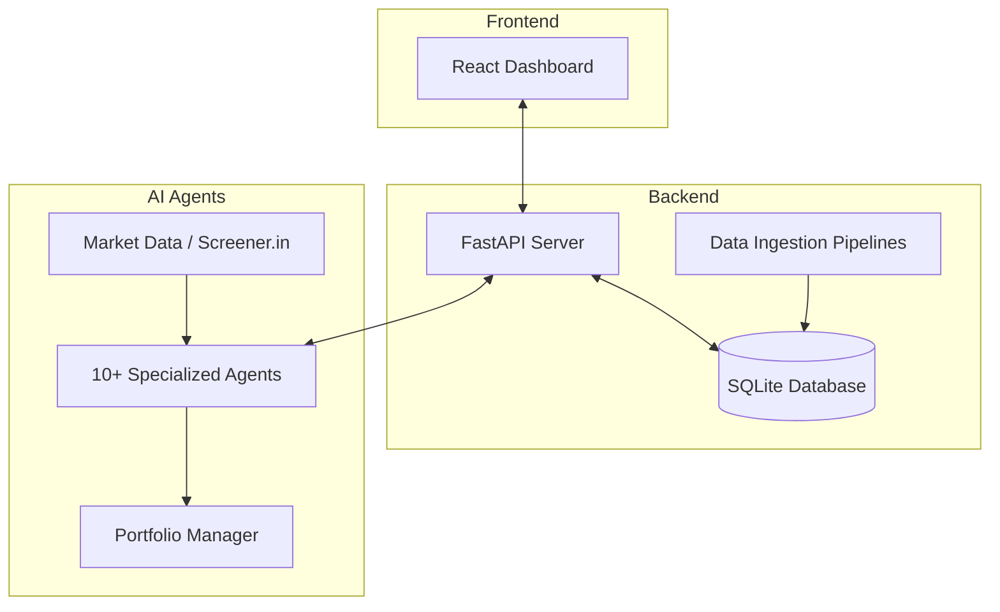

# AI Hedge Fund (Indian Market Edition)

This is a proof of concept for an AI-powered hedge fund tailored for the **Indian Stock Market (NSE)**. The goal of this project is to explore the use of AI to make trading decisions, utilizing fundamental data from Screener.in and technical analysis. This project is for **educational** purposes only and is not intended for real trading or investment.

This system employs several agents working together, combined with a robust backend and an interactive frontend dashboard:

1. Aswath Damodaran Agent - The Dean of Valuation, focuses on story, numbers, and disciplined valuation
2. Ben Graham Agent - The godfather of value investing, only buys hidden gems with a margin of safety
3. Bill Ackman Agent - An activist investor, takes bold positions and pushes for change
4. Cathie Wood Agent - The queen of growth investing, believes in the power of innovation and disruption
5. Charlie Munger Agent - Warren Buffett's partner, only buys wonderful businesses at fair prices
6. Michael Burry Agent - The Big Short contrarian who hunts for deep value
7. Peter Lynch Agent - Practical investor who seeks "ten-baggers" in everyday businesses
8. Phil Fisher Agent - Meticulous growth investor who uses deep "scuttlebutt" research 
9. Stanley Druckenmiller Agent - Macro legend who hunts for asymmetric opportunities with growth potential
10. Warren Buffett Agent - The oracle of Omaha, seeks wonderful companies at a fair price
11. Valuation Agent - Calculates the intrinsic value of a stock and generates trading signals
12. Sentiment Agent - Analyzes market sentiment and generates trading signals
13. Fundamentals Agent - Analyzes fundamental data (via Screener.in) and generates trading signals
14. Technicals Agent - Analyzes technical indicators and generates trading signals
15. Risk Manager - Calculates risk metrics and sets position limits
16. Portfolio Manager - Makes final trading decisions and generates orders

### System Architecture



### Agent Workflow

```mermaid
graph TD
    subgraph Data Sources
        Price[Price Data NSE]
        Fund[Fundamental Data Screener.in]
    end

    subgraph Analysts
        Val[Valuation Agent]
        Sent[Sentiment Agent]
        Tech[Technicals Agent]
        FundA[Fundamentals Agent]
    end

    subgraph Master Investors
        Buffett[Warren Buffett Agent]
        Damodaran[Aswath Damodaran Agent]
        Wood[Cathie Wood Agent]
        Others[...other investor agents]
    end

    Price --> Tech
    Price --> Val
    Fund --> FundA
    Fund --> Val
    
    Analysts --> Risk[Risk Manager]
    Master Investors --> Risk
    Risk --> PM[Portfolio Manager]
```

**Features:**
* **Indian Market Focus:** Designed to analyze NSE tickers (e.g., RELIANCE.NS, TCS.NS).
* **Data Persistence:** Uses an SQLite database (`hedge_fund.db`) to store price and fundamental data.
* **Interactive UI:** A React frontend (`app/`) to view analysis, trigger data ingestion, and manage stock wishlists.
* **Wishlists:** Ability to manage custom lists of stocks for targeted analysis (including a pre-populated Nifty 500 list).
* **Pipelines:** Scripts for ingesting price data (`ingest_prices.py`), fundamental data (`fundamentals_ingest.py`), and running a weekly analysis pipeline.

**Note**: the system simulates trading decisions, it does not actually trade.

[](https://twitter.com/virattt)

## Disclaimer

This project is for **educational and research purposes only**.

- Not intended for real trading or investment
- No warranties or guarantees provided
- Past performance does not indicate future results
- Creator assumes no liability for financial losses
- Consult a financial advisor for investment decisions

By using this software, you agree to use it solely for learning purposes.

## Table of Contents
- [Setup](#setup)
  - [Using Poetry](#using-poetry)
- [Usage](#usage)
  - [Running the Application (Backend & Frontend)](#running-the-application-backend--frontend)
  - [Running the Hedge Fund (CLI)](#running-the-hedge-fund-cli)
  - [Running the Backtester](#running-the-backtester)
  - [Data Ingestion Pipelines](#data-ingestion-pipelines)
- [Project Structure](#project-structure)
- [Contributing](#contributing)
- [Feature Requests](#feature-requests)
- [License](#license)

## Setup

### Using Poetry

Clone the repository:
```bash
git clone https://github.com/virattt/ai-hedge-fund.git
cd ai-hedge-fund
```

1. Install Poetry (if not already installed):
```bash
curl -sSL https://install.python-poetry.org | python3 -
```

2. Install backend dependencies:
```bash
poetry install
```

3. Install frontend dependencies:
```bash
cd app/frontend
npm install
cd ../..
```

4. Set up your environment variables:
```bash
# Create .env file for your API keys
cp .env.example .env
```

5. Set your API keys in the `.env` file:
```bash
# For running LLMs hosted by openai (gpt-4o, gpt-4o-mini, etc.)
OPENAI_API_KEY=your-openai-api-key

# For getting fundamental data for Indian stocks
SCREENER_API_KEY=your-screener-api-key
```

## Usage

### Running the Application (Backend & Frontend)

To run the full application with the interactive dashboard, start both the FastAPI backend and the React frontend.

1. Start the backend server (FastAPI):
```bash
# In one terminal
poetry run uvicorn app.backend.main:app --reload --port 8000
```

2. Start the frontend development server (React/Vite):
```bash
# In a second terminal
cd app/frontend
npm run dev
```

Navigate to `http://localhost:5173` (or the port provided by Vite) in your browser to access the dashboard.

### Running the Hedge Fund (CLI)

You can still run the hedge fund analysis directly from the command line. Ensure you use Yahoo Finance compatible Indian tickers (e.g., `RELIANCE.NS`).

```bash
poetry run python src/main.py --ticker RELIANCE.NS,TCS.NS,HDFCBANK.NS
```

You can also specify a `--show-reasoning` flag to print the reasoning of each agent to the console.

```bash
poetry run python src/main.py --ticker RELIANCE.NS,TCS.NS --show-reasoning
```

### Running the Backtester

```bash
poetry run python src/backtester.py --ticker RELIANCE.NS,TCS.NS
```

You can optionally specify the start and end dates to backtest over a specific time period.

```bash
poetry run python src/backtester.py --ticker RELIANCE.NS --start-date 2024-01-01 --end-date 2024-03-01
```

### Data Ingestion Pipelines

Before running analysis, you may want to ingest recent data into the local database.

Ingest daily prices:
```bash
poetry run python ingest_prices.py --wishlist "Nifty 50"
```

Ingest fundamental data (requires Screener API):
```bash
poetry run python fundamentals_ingest.py --wishlist "Nifty 50"
```

## Project Structure 
```
ai-hedge-fund/
├── app/
│   ├── backend/              # FastAPI backend server
│   ├── frontend/             # React/Vite interactive dashboard
├── src/
│   ├── agents/               # Agent definitions and workflow
│   ├── db/                   # Database connection and schema
│   ├── tools/                # Agent tools (API integrations)
│   ├── utils/                # Utility functions
│   ├── backtester.py         # Backtesting tools
│   ├── main.py               # Main entry point (CLI hedge fund)
├── pipelines/                # Recurring pipelines (e.g., weekly runs)
├── ingest_prices.py          # Script to ingest price data
├── fundamentals_ingest.py    # Script to ingest fundamental data
├── hedge_fund.db             # SQLite database (generated)
├── pyproject.toml
├── ...
```

## Contributing

1. Fork the repository
2. Create a feature branch
3. Commit your changes
4. Push to the branch
5. Create a Pull Request

**Important**: Please keep your pull requests small and focused. This will make it easier to review and merge.

## Feature Requests

If you have a feature request, please open an [issue](https://github.com/virattt/ai-hedge-fund/issues) and make sure it is tagged with `enhancement`.

## License

This project is licensed under the MIT License - see the LICENSE file for details.
